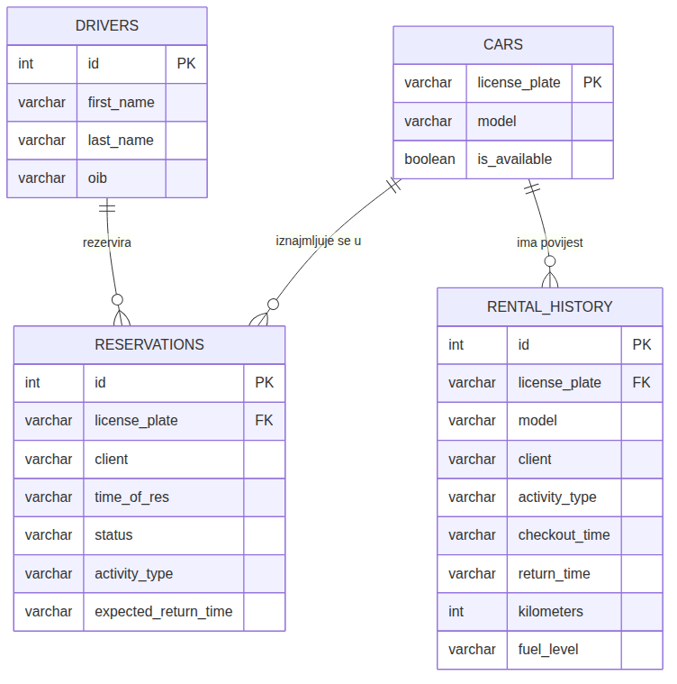

# FleetPilot — tehnička dokumentacija projekta

## 1. Dijagram klasa

Dijagram klasa (Slika 1) prikazuje cjelokupnu strukturu projekta.


*Slika 1 – Dijagram klasa projekta FleetPilot*

Domenske klase (`Car`, `Driver`, `Reservation`, `Activity`) su jednostavni nositelji podataka (POJO) koji predstavljaju jedan redak iz baze podataka unutar Java aplikacije. Ne sadrže logiku pristupa bazi – ta je odgovornost izdvojena u zasebne DAO klase:

- **CarDAO** upravlja tablicom `cars` – dohvat, spremanje, promjena dostupnosti i brisanje vozila.
- **DriverDAO** upravlja tablicom `drivers` – dohvat i spremanje vozača koji se prikazuju u padajućem izborniku pri stvaranju nove aktivnosti.
- **ReservationDAO** upravlja tablicom `reservations` te statusnim tokom rezervacije (`ACTIVE` → `CHECKED_OUT` → brisanje pri završetku).
- **RentalHistoryDAO** upravlja tablicom `rental_history`, trajnim zapisom svih završenih iznajmljivanja, i koristi se za pretragu (`SearchPanel`) i pregled povijesti (`CheckoutPanel`).

Svaka DAO klasa komunicira s bazom preko JDBC-a (`java.sql.*`) i vraća/prima instance odgovarajuće domenske klase, čime je poslovna logika u potpunosti odvojena od SQL upita.

Na DAO sloj se nadovezuje Command sloj: sve akcije korisnika (potvrda forme, klik na gumb) izvedene su kroz `Command` sučelje s jednom metodom `execute()`. Konkretne naredbe (`CreateReservationCommand`, `CreateServiceActivityCommand`, `CheckOutReservationCommand`, `CompleteReturnCommand`, `ResetAllDataCommand`) enkapsuliraju jednu poslovnu operaciju i pozivaju jednu ili više DAO klasa (receiver).

GUI komponente (`NewActivityPanel`, `ReservationFrame`, `ReturnsFrame`, `ToolBar`) su u ovom obrascu invokeri – ne sadrže poslovnu logiku, već samo instanciraju odgovarajuću naredbu i pozivaju `execute()`. `MainFrame` je vrhovna komponenta (`JFrame`) koja sadrži `ToolBar` i `FromPanel` te po potrebi instancira ostale panele/okvire (`ReservationFrame`, `ReturnsFrame`, `NewActivityPanel`) unutar centralnog `contentPanel`-a.

---

## 2. ERD dijagram baze podataka

Baza podataka je relacijska MySQL baza (hostirana na Aiven cloud servisu). Sastoji se od četiri tablice:



*Slika 3 – ERD dijagram baze podataka FleetPilot*

- **cars** – matični podaci o vozilima (registracija kao primarni ključ, model, dostupnost).
- **drivers** – matični podaci o vozačima (ime, prezime, OIB).
- **reservations** – aktivne i trenutno unajmljene stavke; svaki redak ima status (`ACTIVE` / `CHECKED_OUT`), tip aktivnosti (`RESERVATION` / `CAR_WASH` / `GAS_REFILL`) i vrijeme preuzimanja/povrata.
- **rental_history** – trajni log završenih iznajmljivanja (kilometraža, razina goriva, vremena preuzimanja i povrata) koji se ne briše funkcijom "Reset All Data", jer predstavlja povijesni/revizijski zapis.

Veze `license_plate` (`reservations`, `rental_history`) prema `cars.license_plate` logički su strani ključevi (FK) koji povezuju svaku rezervaciju/povijesnu stavku s točno jednim vozilom; vozač je u `reservations` trenutno pohranjen kao tekstualni podatak (ime i prezime), a ne formalni FK prema `drivers`, što je jedno od mogućih budućih poboljšanja modela.

---

## 3. Korišteni principi razvoja i dizajnerski obrasci

### 3.1. DAO (Data Access Object)

Cijeli projekt dosljedno koristi DAO obrazac: svaka domenska klasa (`Car`, `Driver`, `Reservation`, `Activity`/`RentalHistory`) ima pripadnu DAO klasu koja je jedino mjesto u kodu gdje se piše SQL i otvara JDBC konekcija. Prednost je jasna: GUI sloj i poslovna logika ne ovise o načinu pohrane podataka – da smo kasnije htjeli zamijeniti MySQL nekom drugom bazom, mijenjale bi se samo DAO klase.

### 3.2. Command predložak (Command pattern)

Command obrazac uveden je kako bi se odvojio invoker (GUI komponenta koja pokreće akciju) od receivera (DAO klase koje stvarno izvršavaju operaciju nad podacima). Svaka poslovna operacija (stvaranje rezervacije, preuzimanje vozila, povrat vozila, izravni checkout za pranje/gorivo, reset svih podataka) implementirana je kao zasebna klasa s metodom `execute()`.

Razlozi za odabir ovog obrasca u odnosu na direktne pozive iz action listenera:

- **Odvajanje odgovornosti** – GUI komponente (`ActionListener` implementacije) više ne sadrže poslovnu logiku, samo je pokreću.
- **Testabilnost** – svaka naredba može se testirati izolirano, bez pokretanja Swing sučelja.
- **Proširivost** – lako je dodati `undo()` metodu, logiranje izvršenih naredbi (audit log akcija) ili složene (makro) naredbe koje kombiniraju više osnovnih, bez diranja GUI koda.

### 3.3. Odnos prema MVC arhitekturi

Projekt ne implementira striktan MVC (Model-View-Controller) u klasičnom smislu, ali slojevi se mogu preslikati na MVC ideju:

- **Model**: domenske klase (`Car`, `Driver`, `Reservation`, `Activity`) zajedno s DAO slojem koji ih perzistira.
- **View**: Swing paneli i okviri (`ReservationsPanel`, `ReturnsPanel`, `CheckoutPanel`, `SearchPanel`, `NewActivityPanel`, `ReservationFrame`, `ReturnsFrame`).
- **Controller**: Command klase i listener sučelja koja prevode korisničku akciju u poziv nad modelom te vraćaju rezultat natrag u View kroz osvježavanje panela.

Prednosti MVC pristupa (i pristupa koji smo koristili) su jasna podjela odgovornosti, lakše testiranje poslovne logike neovisno o sučelju te mogućnost zamjene jednog sloja (npr. GUI tehnologije) bez diranja ostalih. Nedostatak čistog MVC-a je što u manjim Swing aplikacijama granica View/Controller često postaje nejasna (Swing komponente same sebi registriraju listenere), pa smo tu granicu dodatno ojačali uvođenjem Command sloja – Command klase preuzimaju ulogu "tankog" kontrolera, dok View komponente ostaju isključivo zadužene za prikaz i prosljeđivanje korisničkih akcija.

### 3.4. Višenitno programiranje

Aplikacija ne koristi eksplicitno višenitno programiranje (dodatne niti, `ExecutorService` i sl.) – sve JDBC operacije izvršavaju se sinkrono na Swing Event Dispatch Threadu (EDT), jer su upiti prema bazi kratki, a broj istovremenih korisnika u ovom (učioničkom/pojedinačnom) projektu je nizak. Svjesni smo da bi u produkcijskom okruženju duže operacije nad bazom trebalo izmjestiti u pozadinsku nit (npr. `SwingWorker`) kako se sučelje ne bi zamrzavalo, no za opseg ovog projekta to nije procijenjeno nužnim.

---

## 4. Vanjske biblioteke, moduli i paketi

U projektu su korištene sljedeće vanjske biblioteke, upravljane putem Mavena (`pom.xml`):

| Biblioteka | Namjena u projektu | Verzija / koordinate |
|---|---|---|
| MySQL Connector/J | JDBC upravljački program (driver) koji omogućuje Java aplikaciji spajanje na MySQL bazu podataka (Aiven cloud) iz svih DAO klasa. | `com.mysql:mysql-connector-j` |
| Google Gson | Serijalizacija/deserijalizacija JSON podataka; koristi se u pomoćnoj klasi `AUX_CLS` za čitanje konfiguracijskih/pomoćnih podataka iz JSON datoteka. | `com.google.code.gson:gson` |
| LGoodDatePicker | Swing komponenta (`DateTimePicker`) koja korisniku nudi kalendar i biranje vremena umjesto ručnog upisa datuma, korištena u `NewActivityPanel` i `ReservationFrame`. | `com.github.lgooddatepicker:LGoodDatePicker` (v11.2.1) |

### 4.1. Izvori i dokumentacija

- **MySQL Connector/J** – preuzimanje: <https://dev.mysql.com/downloads/connector/j/>
- MySQL Connector/J – dokumentacija: <https://dev.mysql.com/doc/connector-j/en/>
- MySQL Connector/J – Maven Central: <https://mvnrepository.com/artifact/com.mysql/mysql-connector-j>

- **Gson** – GitHub repozitorij i preuzimanje: <https://github.com/google/gson>
- Gson – korisnički vodič (dokumentacija): <https://github.com/google/gson/blob/main/UserGuide.md>
- Gson – Maven Central: <https://mvnrepository.com/artifact/com.google.code.gson/gson>

- **LGoodDatePicker** – GitHub repozitorij i preuzimanje: <https://github.com/LGoodDatePicker/LGoodDatePicker>
- LGoodDatePicker – dokumentacija (README + primjeri): <https://github.com/LGoodDatePicker/LGoodDatePicker#readme>
- LGoodDatePicker – Maven Central: <https://mvnrepository.com/artifact/com.github.lgooddatepicker/LGoodDatePicker>

---

## 5. Git aciklički graf povijesti repozitorija

Ovdje treba umetnuti snimku zaslona (screenshot) grafa povijesti commitova iz vlastitog Git repozitorija projekta.

### 5.1. Kako doći do grafa

- **IntelliJ IDEA**: otvori "Git" karticu pri dnu prozora (**Git → Log**), graf commitova s granama prikazan je lijevo; napravi snimku zaslona.
- **Terminal** (tekstualni graf): pokreni naredbu `git log --all --graph --oneline --decorate` unutar korijenskog direktorija repozitorija.
- **GitHub/GitLab**: na stranici repozitorija otvori **Insights → Network** (GitHub) ili **Repository → Graph** (GitLab) za vizualni prikaz grana i spajanja.
- **gitk** (ako je instaliran): pokreni `gitk --all` za grafičko sučelje s prikazom cijele povijesti.

Preporuka: prije predaje provjeri da graf jasno prikazuje više commitova kroz vrijeme (idealno s vidljivim porukama commitova) kako bi se vidjela postupnost razvoja projekta.

Snimku spremi kao npr. `git_graph.png` u isti folder kao i ovaj `.md` fajl, pa je ovdje umetni ovako:

```markdown

```

<!-- OVDJE UMETNUTI SNIMKU ZASLONA GIT GRAFA -->